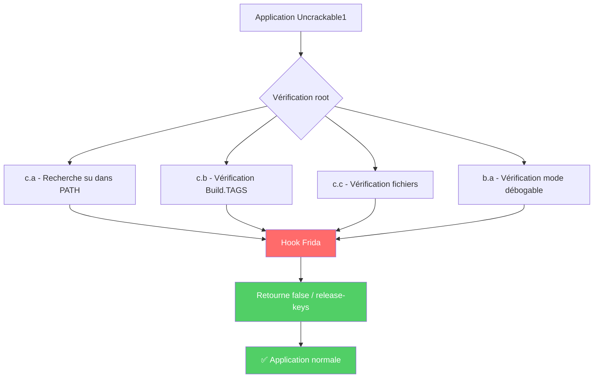

# Lab 11 - Bypass de la Détection de Root Android avec Frida

## 📱 Description

Ce laboratoire démontre comment une application Android peut détecter la présence d'un accès **root** sur un appareil, et comment utiliser **Frida** (framework d'instrumentation dynamique) pour **contourner** ces détections.

L'application cible est **Uncrackable1** de l'OWASP MSTG (Mobile Security Testing Guide), une application volontairement vulnérable conçue pour apprendre les techniques de reverse engineering et de bypass de sécurité.

## 🎯 Objectifs du lab

| Objectif | Statut |
|----------|--------|
| Comprendre comment les applications détectent le root (Java) | ✅ |
| Comprendre comment les applications détectent le root (Natif/C++) | ✅ |
| Utiliser Frida pour hooker des méthodes Java | ✅ |
| Utiliser Frida pour hooker des fonctions natives (libc) | ✅ |
| Contourner la détection de Frida elle-même (anti-anti-Frida) | ✅ |
| Capturer le secret caché dans l'application | ✅ |

## 🛠️ Technologies utilisées

| Technologie | Rôle |
|-------------|------|
| **Frida** | Framework d'instrumentation dynamique |
| **frida-server** | Agent tournant sur l'Android |
| **ADB** | Communication PC ↔ Android |
| **JavaScript** | Langage des scripts Frida |
| **JADX** | Décompilateur Java (analyse statique) |
| **Uncrackable1** | Application cible (OWASP MSTG) |

## ⚠️ Avertissement éthique

> Ces techniques sont à usage **pédagogique UNIQUEMENT**. Ne les utilisez que sur :
> - Vos propres applications
> - Des applications de test autorisées (comme Uncrackable1)
> - Des appareils que vous possédez

## 📊 Analyse statique avec JADX

Avant d'écrire nos scripts Frida, on a analysé l'APK avec **JADX** pour comprendre comment l'application détecte le root.

### Résultat de l'analyse

La classe `sg.vantagepoint.a.c` contient 3 méthodes de détection :

```java
public class c {
    // Méthode 1 : Recherche de "su" dans le PATH
    public static boolean a() {
        for (String str : System.getenv("PATH").split(":")) {
            if (new File(str, "su").exists()) {
                return true;  // Root detected !
            }
        }
        return false;
    }

    // Méthode 2 : Vérification des tags système
    public static boolean b() {
        String str = Build.TAGS;
        return str != null && str.contains("test-keys");
    }

    // Méthode 3 : Vérification de fichiers spécifiques
    public static boolean c() {
        String[] paths = {
            "/system/app/Superuser.apk",
            "/system/xbin/daemonsu",
            "/system/etc/init.d/99SuperSUDaemon",
            "/system/bin/.ext/.su",
            "/system/etc/.has_su_daemon",
            "/system/etc/.installed_su_daemon",
            "/dev/com.koushikdutta.superuser.daemon/"
        };
        for (String path : paths) {
            if (new File(path).exists()) {
                return true;  // Root detected !
            }
        }
```
> De plus, la classe sg.vantagepoint.a.b vérifie si l'application est en mode débogable :
```java
public class b {
    public static boolean a(Context context) {
        return (context.getApplicationContext().getApplicationInfo().flags & 2) != 0;
    }
}
```

## 📊 Ce qu'on a appris de l'analyse statique

Grâce à l'analyse avec **JADX**, nous avons identifié les classes responsables de la détection de root dans l'application Uncrackable1.

### Tableau récapitulatif des méthodes de détection

| Classe | Méthode | Ce qu'elle vérifie |
|--------|---------|-------------------|
| `c` | `a()` | Présence de la commande `su` dans le PATH système |
| `c` | `b()` | Build.TAGS contient "test-keys" (indique un build rooté) |
| `c` | `c()` | Fichiers spécifiques (Superuser.apk, daemonsu, etc.) |
| `b` | `a()` | Mode débogable actif (debuggable) |

## 🚀 Scripts Frida créés

### 1. bypass_root.js - Hook des détections Java

Emplacement : scripts/bypass_root.js

```java
// bypass_root.js - Neutralise les détections de root en Java

Java.perform(function() {
    console.log("[*] Démarrage du bypass Java pour Uncrackable1");
    
    // 1. Hook de File.exists() pour cacher les fichiers suspects
    var suspiciousPaths = [
        "/sbin/su", "/system/bin/su", "/system/xbin/su", "/system/sbin/su",
        "/system/app/Superuser.apk", "/system/xbin/daemonsu",
        "/system/etc/init.d/99SuperSUDaemon", "/system/bin/.ext/.su",
        "/system/etc/.has_su_daemon", "/system/etc/.installed_su_daemon",
        "/dev/com.koushikdutta.superuser.daemon/"
    ];
    
    var File = Java.use("java.io.File");
    File.exists.implementation = function() {
        var path = this.getAbsolutePath();
        if (suspiciousPaths.indexOf(path) !== -1) {
            console.log("[+] File.exists() bypassé pour: " + path);
            return false;
        }
        return this.exists.call(this);
    };
    
    // 2. Hook de Build.TAGS
    var Build = Java.use("android.os.Build");
    Object.defineProperty(Build, "TAGS", {
        get: function() {
            console.log("[+] Build.TAGS retourne 'release-keys'");
            return "release-keys";
        }
    });
    
    // 3. Hook DIRECT des méthodes de détection (approche radicale)
    var c = Java.use("sg.vantagepoint.a.c");
    c.a.implementation = function() {
        console.log("[+] c.a() intercepté - retourne false");
        return false;
    };
    c.b.implementation = function() {
        console.log("[+] c.b() intercepté - retourne false");
        return false;
    };
    c.c.implementation = function() {
        console.log("[+] c.c() intercepté - retourne false");
        return false;
    };
    
    // 4. Hook de la détection de débogage
    var b = Java.use("sg.vantagepoint.a.b");
    b.a.implementation = function(ctx) {
        console.log("[+] b.a() intercepté - retourne false");
        return false;
    };
    
    console.log("[*] Bypass Java prêt !");
});

```

### 2. bypass_native.js - Hook des détections natives

Emplacement : scripts/bypass_native.js

```java
// bypass_native.js - Neutralise les vérifications natives (C/C++)

console.log("[*] Chargement du bypass natif...");

var SUS = [
    "/sbin/su", "/system/bin/su", "/system/xbin/su", "/system/sbin/su",
    "/system/app/Superuser.apk", "/system/xbin/daemonsu",
    "/system/bin/busybox", "/system/xbin/busybox",
    "/proc/mounts", "/proc/self/mounts"
];

function isSuspiciousPath(ptrPath) {
    try {
        var p = ptrPath.readCString();
        if (!p) return false;
        for (var i = 0; i < SUS.length; i++) {
            if (p.indexOf(SUS[i]) !== -1) {
                console.log("[!] Chemin suspect détecté: " + p);
                return true;
            }
        }
        return false;
    } catch(e) {
        return false;
    }
}

function hookFunc(name, argIndexForPath) {
    try {
        var addr = Module.getExportByName(null, name);
        if (addr) {
            Interceptor.attach(addr, {
                onEnter: function(args) {
                    var pathPtr = argIndexForPath >= 0 ? args[argIndexForPath] : null;
                    if (pathPtr && isSuspiciousPath(pathPtr)) {
                        this.block = true;
                        this.path = pathPtr.readCString();
                    }
                },
                onLeave: function(retval) {
                    if (this.block) {
                        console.log("[+] Blocked " + name + " sur " + this.path);
                        retval.replace(ptr(-1));
                    }
                }
            });
            console.log("[+] Hooked " + name);
        }
    } catch(e) {}
}

hookFunc('open', 0);
hookFunc('openat', 1);
hookFunc('access', 0);
hookFunc('stat', 0);
hookFunc('lstat', 0);
hookFunc('fopen', 0);

console.log("[*] Bypass natif prêt !");

```

### 3. anti_frida.js - Masquage de Frida

Emplacement : scripts/anti_frida.js

```java
// anti_frida.js - Cache les traces de Frida

Java.perform(function() {
    // Masquer les variables d'environnement Frida
    try {
        var Sys = Java.use('java.lang.System');
        Sys.getenv.overload('java.lang.String').implementation = function(name) {
            if (name && name.toLowerCase().indexOf('frida') !== -1) {
                console.log('[+] Variable masquée:', name);
                return null;
            }
            return this.getenv(name);
        };
        console.log("[+] Hook getenv() installé");
    } catch(e) {}
    
    // Bloquer les connexions aux ports Frida
    try {
        var Socket = Java.use('java.net.Socket');
        Socket.connect.overload('java.net.SocketAddress').implementation = function(addr) {
            var s = addr.toString();
            if (s.indexOf(':27042') !== -1 || s.indexOf(':27043') !== -1) {
                console.log('[+] Connexion bloquée vers', s);
                throw new Error('Connection refused');
            }
            return this.connect(addr);
        };
        console.log("[+] Hook Socket.connect() installé");
    } catch(e) {}
    
    console.log("[*] Anti-Frida prêt !");
});

```


## 🔧 Procédure d'exécution

### Étape 1 : Prérequis

```bash
# Vérifier Frida
frida --version

# Vérifier la connexion ADB
adb devices

# Démarrer frida-server sur l'Android
adb shell "/data/local/tmp/frida-server -l 0.0.0.0 &"

# Forwarder les ports
adb forward tcp:27042 tcp:27042
adb forward tcp:27043 tcp:27043

```


### Étape 2 : Vérifier que l'app est visible

```bash
frida-ps -Uai | grep -i uncrackable

```

Résultat attendu :

```bash
Uncrackable1          owasp.mstg.uncrackable1

```


### Étape 3 : Lancer tous les scripts ensemble

```bash
frida -U -f owasp.mstg.uncrackable1 \
  -l scripts/bypass_root.js \
  -l scripts/bypass_native.js \
  -l scripts/anti_frida.js \
  --no-pause

```

## 📱 Comportement de l'application

| Situation | Résultat |
|-----------|----------|
| **Sans Frida** | Message "Root detected!" + l'application se ferme |
| **Avec nos scripts** | L'application s'ouvre normalement, champ pour entrer le secret |

---

## 🐛 Problème rencontré et solution

### Problème : Détection persistante même avec nos hooks

Au début, seul le script `bypass_root.js` ne suffisait pas. L'application détectait encore le root.

### Cause identifiée

L'application utilisait des **méthodes de détection supplémentaires** que nous n'avions pas hookées.

### Solution

| Étape | Action |
|-------|--------|
| 1 | Ajout des chemins suspects de `c.c()` dans notre liste |
| 2 | Hook **direct** des méthodes `c.a()`, `c.b()`, `c.c()` (approche radicale) |
| 3 | Ajout de `bypass_native.js` pour les vérifications C/C++ |

---

## 📊 Résumé des techniques de bypass

| Technique de détection | Niveau | Notre bypass |
|------------------------|--------|--------------|
| Recherche de "su" dans PATH | Java | Hook `c.a()` → return false |
| Build.TAGS contient "test-keys" | Java | Hook `Build.TAGS` → "release-keys" |
| Fichiers spécifiques (Superuser.apk, etc.) | Java | Hook `c.c()` → return false + Hook `File.exists()` |
| Mode débogable | Java | Hook `b.a()` → return false |
| Accès natif à `/system/bin/su` | C/C++ | Hook `open()`, `access()`, `stat()` → return -1 |
| Variables d'environnement Frida | Java | Hook `getenv()` → return null |
| Scan des ports Frida (27042/27043) | Java | Hook `Socket.connect()` → throw error |

### Illustration du processus de bypass



## 🖼️ Captures d'écran

### Application sans Frida


*Message "Root detected!" affiché - l'application refuse de fonctionner*

---

### Application avec nos scripts Frida


*L'application s'ouvre normalement - bypass réussi !*

---

---

## 📚 Concepts clés à retenir

| Concept | Explication |
|---------|-------------|
| **Hook Java** | Redéfinir une méthode Java pour modifier son comportement (ex: faire retourner `false` à une méthode de détection) |
| **Hook Natif** | Intercepter des fonctions C/C++ comme `open()`, `access()`, `stat()` pour bloquer l'accès aux fichiers suspects |
| **ptrace** | Appel système Linux utilisé pour détecter la présence d'un débogueur attaché au processus |
| **/proc/self/maps** | Fichier virtuel listant toutes les bibliothèques et régions mémoire chargées par le processus courant |
| **Frida** | Framework d'instrumentation dynamique multi-plateforme permettant d'injecter du JavaScript dans des applications |
| **JNI (Java Native Interface)** | Interface permettant au code Java d'appeler et d'être appelé par du code natif C/C++ |
| **AES-ECB** | Mode de chiffrement symétrique utilisé par Uncrackable1 pour cacher le flag |
| **Base64** | Encodage permettant de représenter des données binaires (comme un texte chiffré) sous forme de texte |

## 👤 Auteur

| Information | Détail |
|-------------|--------|
| **Nom complet** | El Hachimi Abdelhamid |
| **Pseudonyme GitHub** | abdotranscript25 |
| **Laboratoire** | Lab 11 - Bypass de la Détection de Root Android avec Frida |
| **Matière** | Programmation Mobile |
| **Année universitaire** | 2025-2026 |

---

## 📅 Date de réalisation

**Avril 2026**

---
